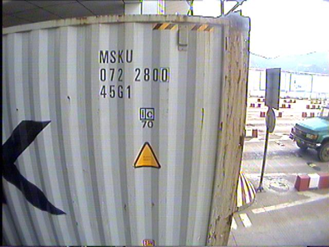
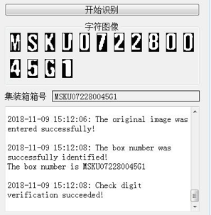

# 基于DSP的字符识别系统

在TMS320C6416开发板和CCS集成环境中，用C语言开发的一个集装箱字符识别系统。

## 集装箱箱号识别





## 系统结构


本字符识别系统主要由字符分割和字符匹配两大部分组成。其中，字符分割包括字符图像的读取及二值化、水平投影、按行竖直投影、字符切割等部分，字符匹配包括字符模板的建立、模板匹配等部分。

1. 字符图像的读取及二值化

首先生成5幅字符个数及排列随机的字符图像，在输入系统之前经过灰度化预处理变成8位字符灰度图像。系统读取灰度图像并按行将图像的每个像素位存储于一维数组中，取图像的平均像素值作为阈值对读取后的图像进行二值化处理。

2. 水平投影

统计二值化字符图像中每个像素行灰度值为0（黑点）的像素数量，将每行的统计值存储于一维数组中。依据无字符区统计值为0、有字符区统计值不为0，获取图像中的各行字符区并确定每行字符的水平分割线。

3. 按行竖直投影

依次统计每行字符每个像素列灰度值为0的像素数量，按行将各行字符区的统计值存储于二维数组中。依据无字符统计值为0、有字符统计值不为0，确定图像中各个字符的竖直分割线。

4. 字符切割

将各个字符在图像中的行列位置存储于二维6列数组的前2列，并将各个字符对应的水平及竖直分割线的4个坐标存储于二维6列数组的后4列。依据坐标进行字符切割，并将分割出来的各个字符按顺序存储于36*36的三维数组中。

5. 字符模板的建立

在Word中打出包括大写字母、小写字母及数字的62个字符，按照前面的步骤对输入的字符模板图像进行字符切割，并将分割出来的各个字符模板按顺序存储于40*40的三维数组中。

6. 模板匹配

将分割出来的各个字符分别与62个字符模板进行匹配，取36*36的模板块在字符模板里遍历各个区域，在与字符图像进行比对后得到字符块与该模板块匹配的归一化交叉相关Normalization cross correlation (NCC)系数


依次将字符图像与62个字符模板匹配的最大相似度系数存储于长度为62的一维数组中，通过比较数组中相似度系数的最大值所在的模板位置输出打印该字符图像对应的字符。

## 调试问题

- 输入图像的像素宽度必须为4的倍数

由于TMS320C6416是32位的定点DSP，而8位灰度图像的每个像素位在存储时占1个字节，当输入图像的像素宽度不为4的倍数时，已存储的每个像素行末尾因不足32位会自动补0，即填充为黑点，这也会使指针在按行读取图像时初始指向位置发生偏移，使得在查看图像时出现字符倾斜、有未知黑线等问题。

- DSP内部RAM空间不足

由于最初在编写程序时未考虑的DSP内存大小，将大数据量的数组都存储于内部RAM中，使得程序因为内存不足而报错。在查阅DSP内部存储空间分配的相关资料后，发现程序的代码段和数据段都存储于IRAM里，而IRAM的最大存储空间一般为0x0002FFFF，这对于存储大量的大数组是不够的。在将大数组存储于在SDRAM中定义的.img_buf段后，解决了程序中数据在存储过程中遇到的内存不足问题。

```c
#pragma DATA_ALIGN (srcImage,8);
#pragma DATA_SECTION (srcImage,".img_buf");

#pragma DATA_ALIGN (threshImage,8);
#pragma DATA_SECTION (threshImage,".img_buf");

#pragma DATA_ALIGN (segImage,8);
#pragma DATA_SECTION (segImage,".img_buf");
```

